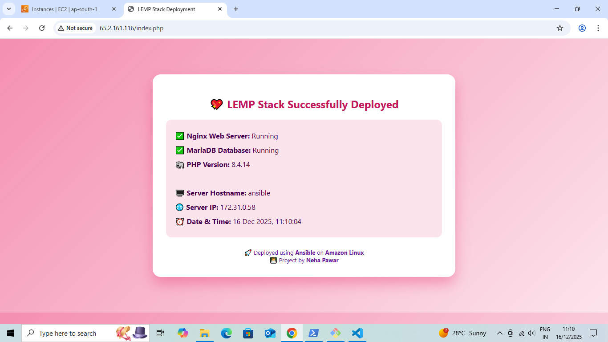

#  LEMP Stack Deployment using Ansible

[](https://www.ansible.com/)
[](https://aws.amazon.com/amazon-linux-2/)
[](https://www.php.net/)
[](https://mariadb.org/)
[](https://www.nginx.com/)

---

##  Project Overview

This project demonstrates a **full LEMP stack deployment** (Linux, Nginx, MariaDB, PHP) using **Ansible**, with variables for flexibility.  
The playbook installs all components, starts services, and deploys a dynamic PHP web page showing server status.

---


---

##  Features

- Installs **Nginx**, **MariaDB**, **PHP + PHP-FPM**  
- Starts and enables all services  
- Deploys a styled `index.php` page showing:
  - Web & Database status  
  - PHP version  
  - Server Hostname & IP  
  - Current Date & Time  
- Clean, reusable playbook using **variables**  
- Fully **idempotent**  

---

##  Variables

| Variable       | Description |
|----------------|-------------|
| `web_pkg`      | Web server package (`nginx`) |
| `db_pkg`       | Database server package (`mariadb105-server`) |
| `php_pkg`      | PHP packages (`php`, `php-fpm`) |
| `web_service`  | Web service name (`nginx`) |
| `db_service`   | Database service name (`mariadb`) |
| `php_service`  | PHP service name (`php-fpm`) |
| `web_root`     | Web root directory (`/usr/share/nginx/html`) |
| `web_file_path`| Path to deploy PHP page (`/usr/share/nginx/html/index.php`) |

---

##  How to Run

1. Navigate to playbook directory:

```bash
  cd playbook
```

2. Syntax check (optional):
```
ansible-playbook lemp_with_var.yml --syntax-check
```

3. Run the playbook:
```
ansible-playbook lemp_with_var.yml
```

4. Open browser and access:
```
http://<server-ip>/index.php
```

### Deployment Output:


### Tech Stack:

OS: Amazon Linux 2 / CentOS

Web Server: Nginx

Database: MariaDB 10.5

PHP: 8.x

Automation Tool: Ansible

### Author: 
Neha Pawar

LEMP Stack Deployment using Ansible